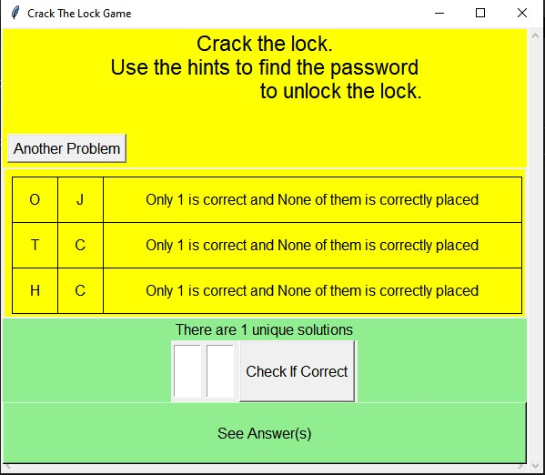
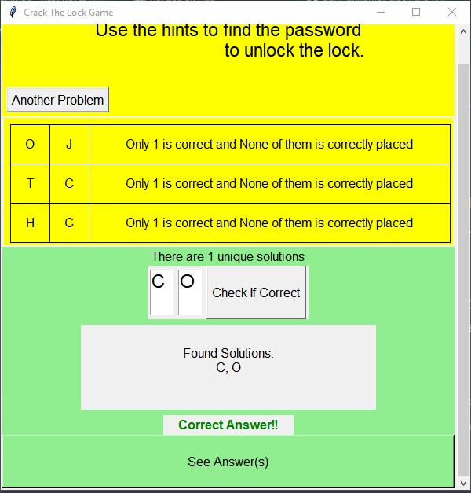
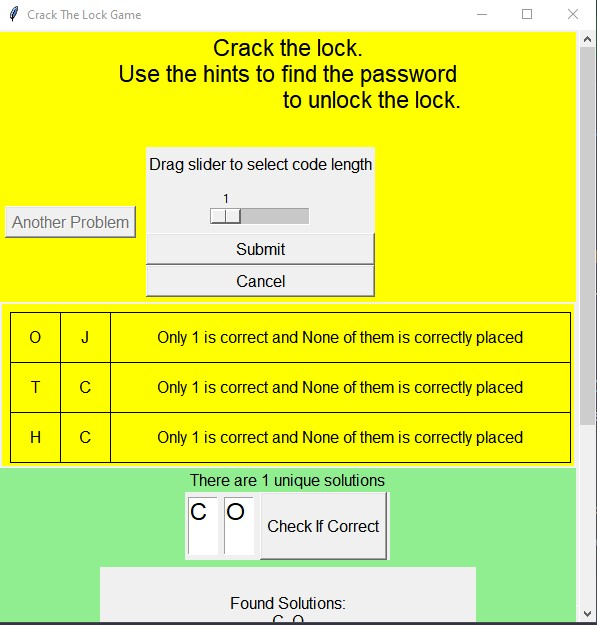
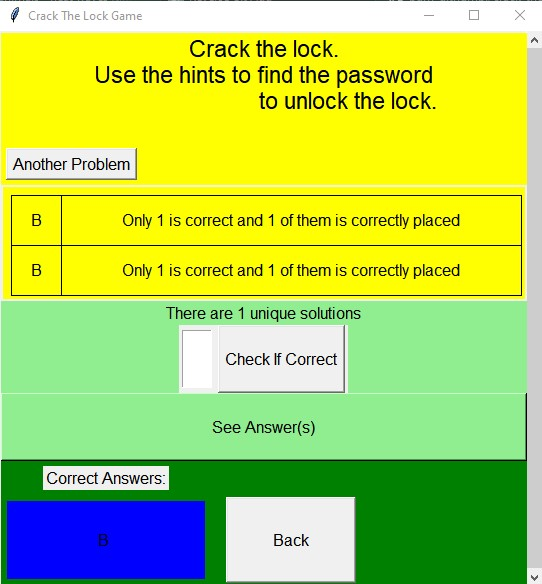
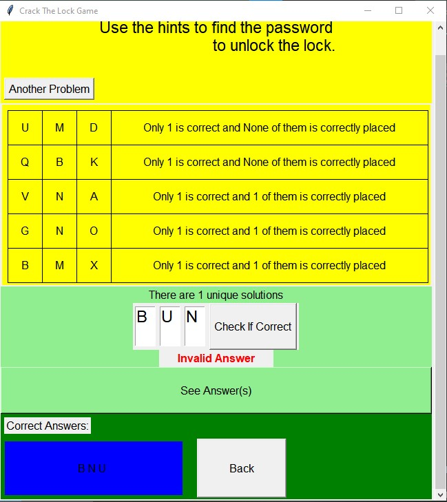

# CRACK THE LOCK GAME

Given a set of strings and a hint of how many characters of said string exists in the key to a lock; and also how many of those characters exist in the same position they exists in the key to a lock; Find the key to the lock.

I saw this problem type on tiktok and I wanted to find a way to solve it using code. I used an inference engine and knowledge-based system to solve the problem before rendering.

I learned alot of GUI stuff while using tkinter to render the problem.

Allows users to attempt to solve the problem and submit their answer.

Allows users to specify a different problem to solve.

Allows users to see the correct answer if they failed to solve the problem.

Contact me at githumbiperezprofessional@gmail.com for job opportunities.